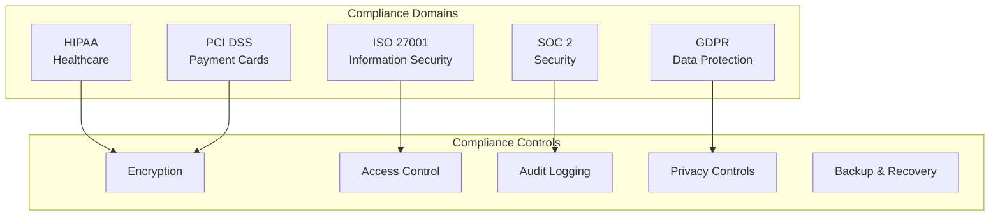
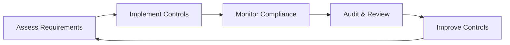
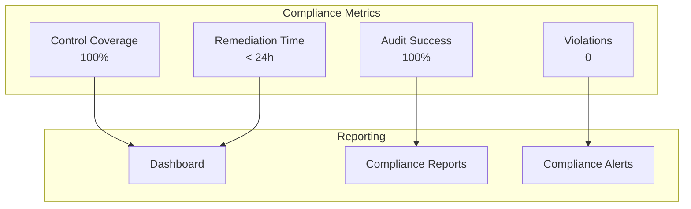

# ✅ Compliance Standards

## 📋 Overview

Comprehensive compliance standards for regulatory requirements, industry standards, and governance frameworks.

## 🏗️ Compliance Framework

## 🔒 Compliance Management

### Compliance Lifecycle

## 📊 Compliance Metrics

### Compliance Dashboard

## 🎯 Compliance Best Practices

1. **Understand Requirements**: Know applicable regulations
2. **Implement Controls**: Technical and process controls
3. **Document Everything**: Maintain compliance documentation
4. **Regular Audits**: Conduct regular compliance audits
5. **Train Staff**: Ensure team understands requirements
6. **Monitor Continuously**: Automated compliance monitoring
7. **Remediate Quickly**: Fast response to violations
8. **Review Regularly**: Update controls as needed
9. **Report Accurately**: Accurate compliance reporting
10. **Continuous Improvement**: Evolve compliance program

---

**Back to**: [Enterprise Standards](../README.md)

