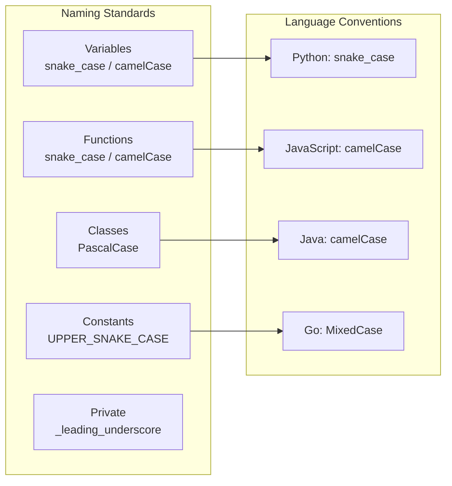
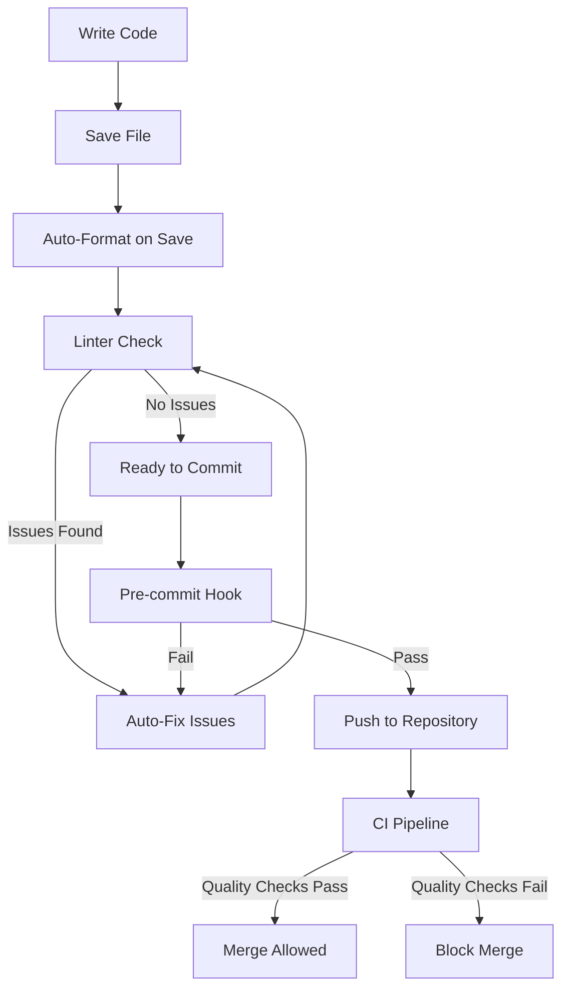
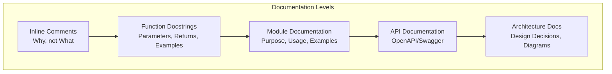
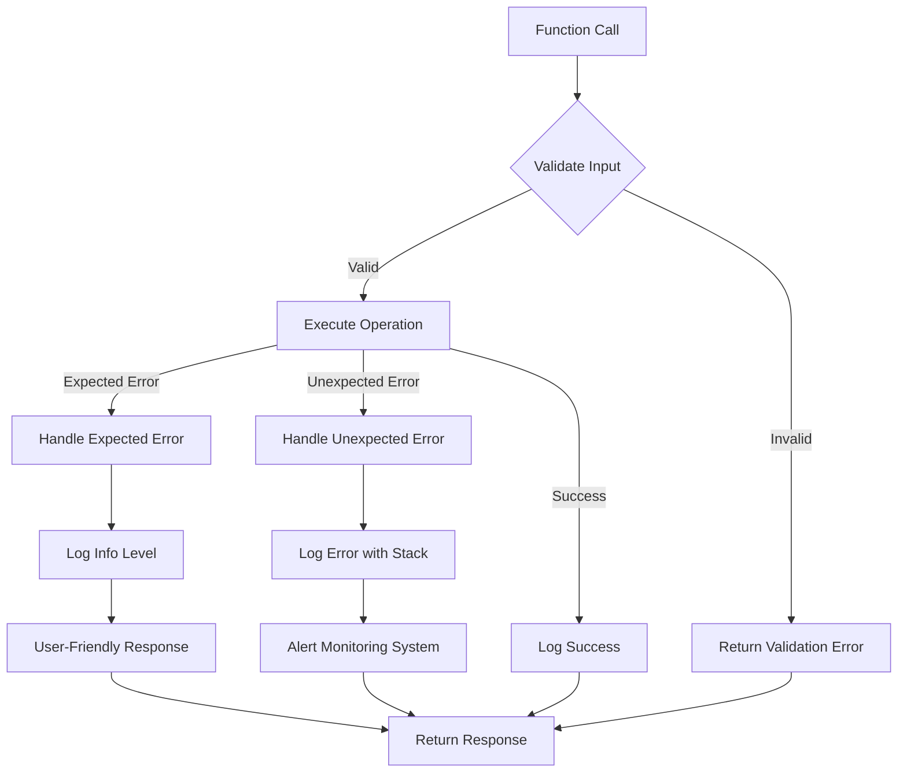
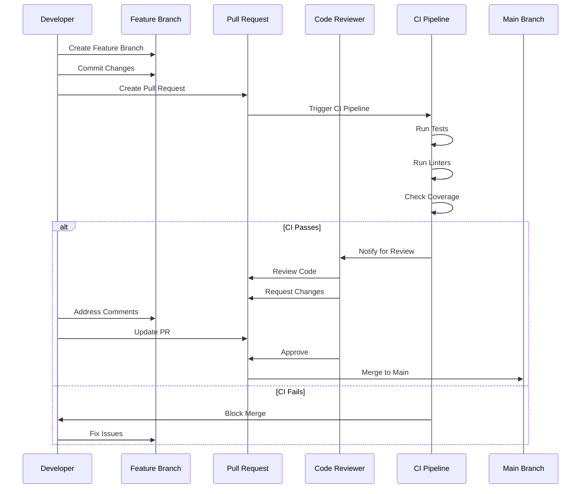
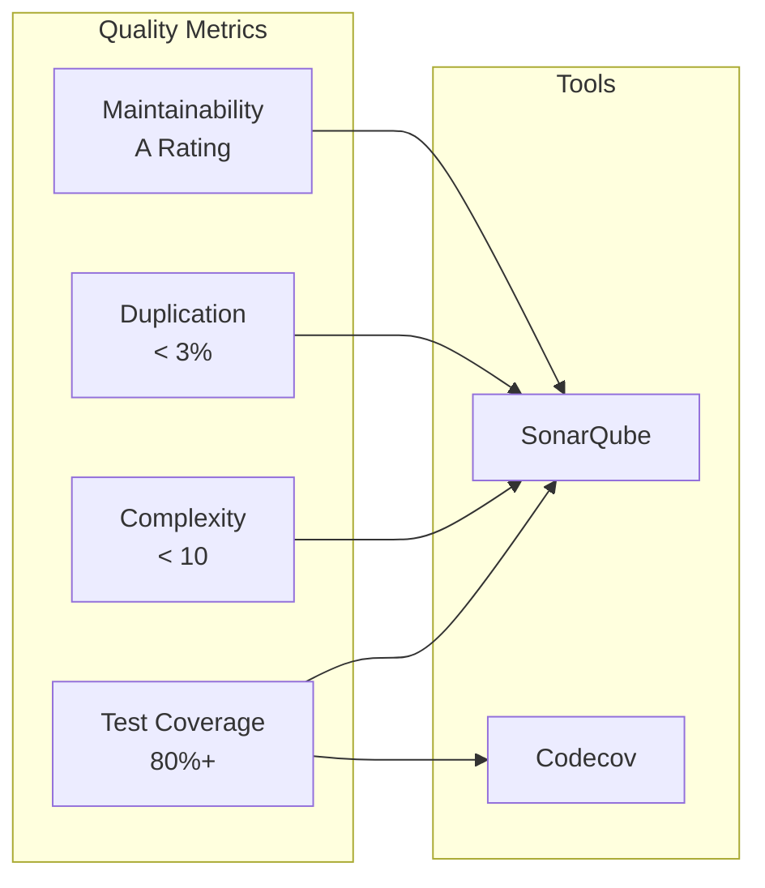
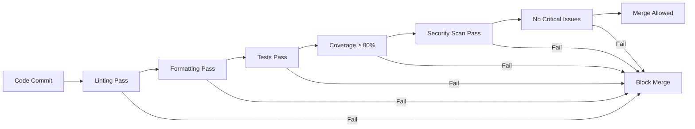

# 📝 Code Quality Standards

## 📋 Overview

This guide defines comprehensive code quality standards to ensure maintainable, readable, and reliable code across all projects.

## 🏗️ Code Quality Framework

```mermaid
graph TB
    subgraph "Code Quality Dimensions"
        subgraph "Readability"
            READ1[Clear Naming]
            READ2[Consistent Style]
            READ3[Proper Formatting]
        end
        
        subgraph "Maintainability"
            MAIN1[Modular Design]
            MAIN2[Low Complexity]
            MAIN3[Documentation]
        end
        
        subgraph "Reliability"
            REL1[Error Handling]
            REL2[Input Validation]
            REL3[Defensive Programming]
        end
        
        subgraph "Performance"
            PERF1[Efficient Algorithms]
            PERF2[Resource Management]
            PERF3[Optimization]
        end
    end
    
    READ1 --> QUALITY[High Quality Code]
    READ2 --> QUALITY
    READ3 --> QUALITY
    MAIN1 --> QUALITY
    MAIN2 --> QUALITY
    MAIN3 --> QUALITY
    REL1 --> QUALITY
    REL2 --> QUALITY
    REL3 --> QUALITY
    PERF1 --> QUALITY
    PERF2 --> QUALITY
    PERF3 --> QUALITY
```



## 📏 Code Style Standards

### Naming Conventions



### Code Formatting Workflow



## 📚 Documentation Standards

### Documentation Hierarchy



### Documentation Template

```python
"""
Module: data_processor.py

Purpose: Process and transform data for machine learning pipelines.

Usage:
    from data_processor import DataProcessor
    
    processor = DataProcessor()
    processed_data = processor.transform(raw_data)

Author: Development Team
Last Updated: 2024-01-15
"""

from typing import List, Dict, Any, Optional
import pandas as pd

class DataProcessor:
    """
    Process and transform data for ML pipelines.
    
    This class provides methods for cleaning, transforming, and validating
    data before it's used in machine learning models.
    
    Attributes:
        config (Dict[str, Any]): Configuration dictionary
        logger: Logger instance for logging operations
    
    Example:
        >>> processor = DataProcessor()
        >>> result = processor.transform(df)
        >>> print(result.head())
    """
    
    def __init__(self, config: Optional[Dict[str, Any]] = None):
        """
        Initialize DataProcessor.
        
        Args:
            config: Optional configuration dictionary. If None, uses defaults.
        
        Raises:
            ValueError: If config contains invalid values.
        """
        self.config = config or self._default_config()
        self._validate_config()
    
    def transform(self, data: pd.DataFrame) -> pd.DataFrame:
        """
        Transform input data according to configured rules.
        
        This method applies data cleaning, normalization, and feature
        engineering transformations to the input DataFrame.
        
        Args:
            data: Input DataFrame to transform. Must contain required columns.
        
        Returns:
            Transformed DataFrame with same index as input.
        
        Raises:
            ValueError: If input data doesn't meet requirements.
            TypeError: If input is not a DataFrame.
        
        Example:
            >>> df = pd.DataFrame({'col1': [1, 2, 3], 'col2': [4, 5, 6]})
            >>> processor = DataProcessor()
            >>> result = processor.transform(df)
            >>> assert len(result) == len(df)
        """
        if not isinstance(data, pd.DataFrame):
            raise TypeError("Input must be a pandas DataFrame")
        
        # Implementation here
        return data
```

## 🔄 Error Handling Standards

### Error Handling Strategy



### Error Handling Best Practices

1. **Use Specific Exceptions**
   ```python
   # Bad
   raise Exception("Error occurred")
   
   # Good
   raise ValueError("Input must be positive integer")
   ```

2. **Provide Context**
   ```python
   try:
       result = process_data(data)
   except ValueError as e:
       raise ValueError(f"Failed to process data: {e}") from e
   ```

3. **Log Appropriately**
   ```python
   logger.info("Operation started", extra={"operation": "process_data"})
   logger.warning("Retry attempt", extra={"attempt": retry_count})
   logger.error("Operation failed", exc_info=True)
   ```

## 🧪 Code Review Standards

### Code Review Process



### Code Review Checklist

- [ ] **Functionality**: Does the code work as intended?
- [ ] **Testing**: Are there adequate tests?
- [ ] **Documentation**: Is code well-documented?
- [ ] **Style**: Does code follow style guidelines?
- [ ] **Security**: Are there security concerns?
- [ ] **Performance**: Are there performance issues?
- [ ] **Error Handling**: Is error handling appropriate?
- [ ] **Complexity**: Is code complexity reasonable?

## 📊 Quality Metrics

### Code Quality Dashboard



## 🎯 Quality Gates

### CI/CD Quality Gates



## 📚 Best Practices Summary

1. **Write Self-Documenting Code**: Use clear names, avoid magic numbers
2. **Keep Functions Small**: Single responsibility, < 50 lines
3. **Avoid Deep Nesting**: Max 3-4 levels of indentation
4. **Use Type Hints**: Improve code clarity and IDE support
5. **Write Tests First**: TDD approach when possible
6. **Review Your Own Code**: Self-review before PR
7. **Refactor Regularly**: Technical debt management
8. **Follow SOLID Principles**: Object-oriented design

---

**Next**: [Security Standards](../security-standards/)

