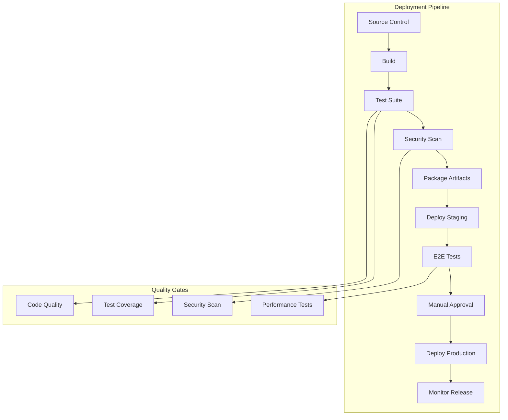
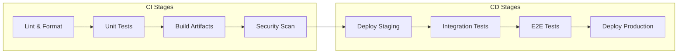
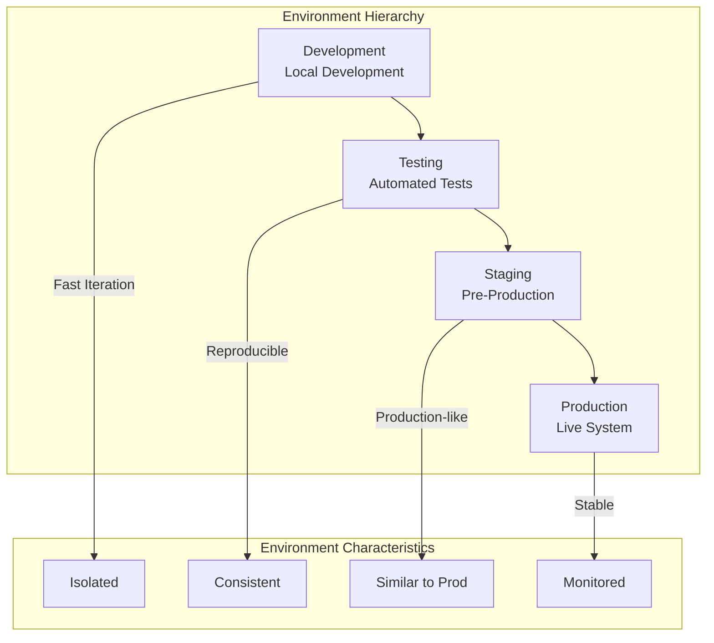
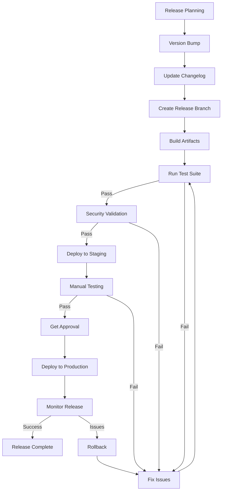
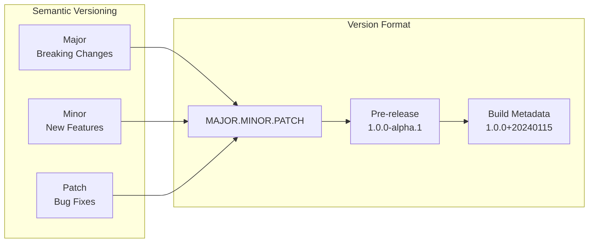
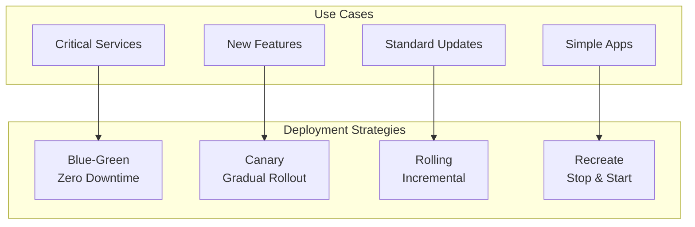
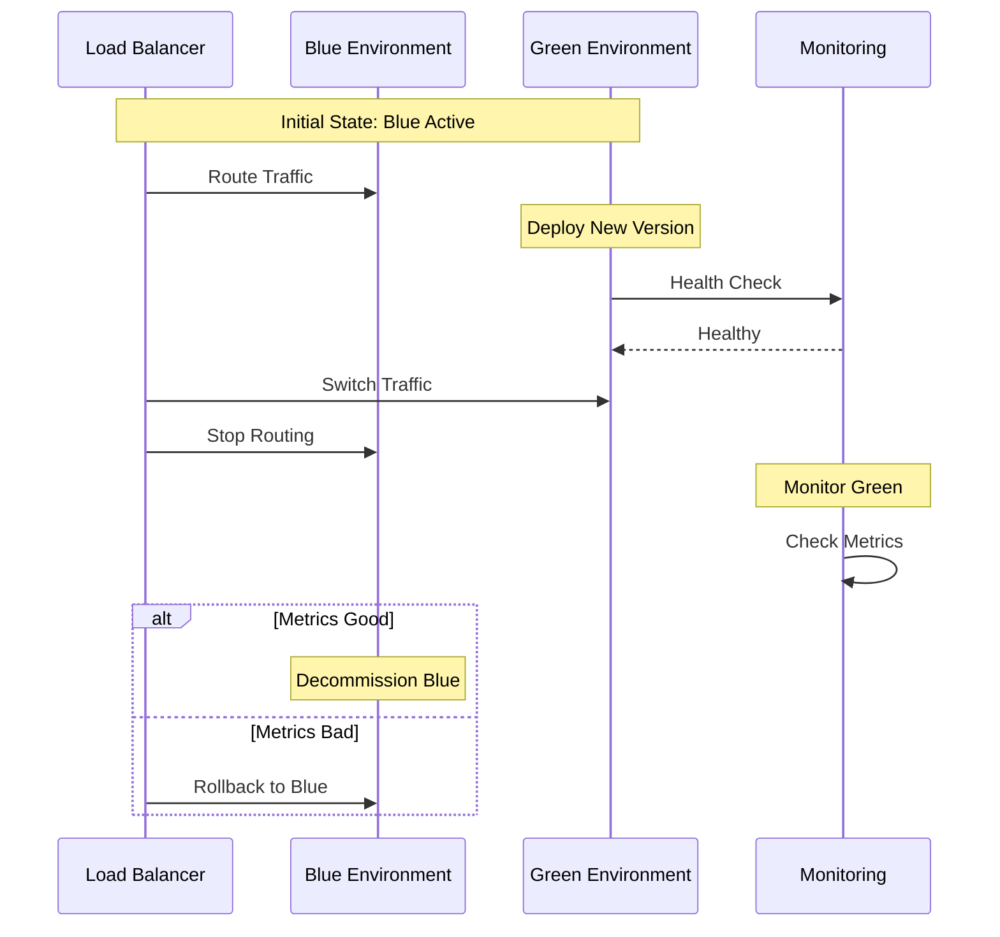
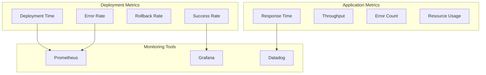
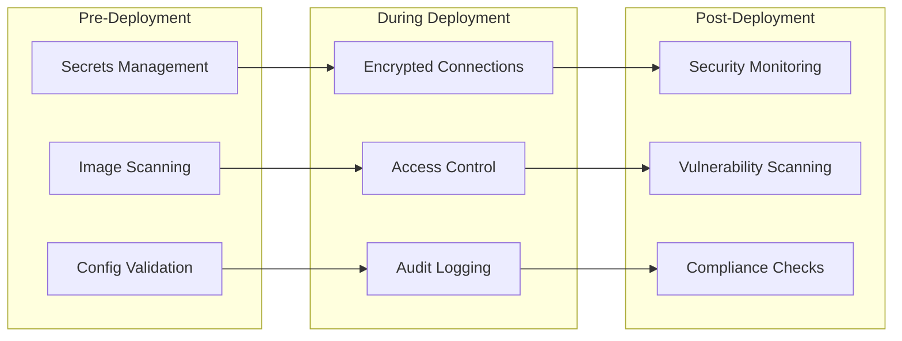

# 🚀 Deployment Standards

## 📋 Overview

Comprehensive deployment standards for reliable, secure, and scalable software deployments across all environments.

## 🏗️ Deployment Architecture



## 🔄 CI/CD Pipeline

### Pipeline Stages



### Pipeline Configuration Example

```yaml
# .github/workflows/deploy.yml
name: Deploy Application

on:
  push:
    branches: [main, develop]
  pull_request:
    branches: [main]

jobs:
  test:
    runs-on: ubuntu-latest
    steps:
      - uses: actions/checkout@v4
      - name: Setup Python
        uses: actions/setup-python@v4
        with:
          python-version: '3.11'
      - name: Install Dependencies
        run: |
          pip install -r requirements.txt
          pip install pytest pytest-cov
      - name: Run Linter
        run: |
          flake8 .
          black --check .
      - name: Run Tests
        run: |
          pytest --cov=. --cov-report=xml
      - name: Check Coverage
        run: |
          coverage report --fail-under=80
  
  security:
    runs-on: ubuntu-latest
    steps:
      - uses: actions/checkout@v4
      - name: Run Security Scan
        uses: snyk/actions/python@master
        env:
          SNYK_TOKEN: ${{ secrets.SNYK_TOKEN }}
  
  build:
    needs: [test, security]
    runs-on: ubuntu-latest
    steps:
      - uses: actions/checkout@v4
      - name: Build Docker Image
        run: |
          docker build -t app:${{ github.sha }} .
      - name: Push to Registry
        run: |
          docker push app:${{ github.sha }}
  
  deploy-staging:
    needs: build
    runs-on: ubuntu-latest
    environment: staging
    steps:
      - name: Deploy to Staging
        run: |
          kubectl set image deployment/app app=app:${{ github.sha }}
  
  deploy-production:
    needs: deploy-staging
    runs-on: ubuntu-latest
    environment: production
    if: github.ref == 'refs/heads/main'
    steps:
      - name: Deploy to Production
        run: |
          kubectl set image deployment/app app=app:${{ github.sha }}
```

## 🌍 Environment Management

### Environment Strategy



### Environment Configuration

```yaml
# environments/staging.yaml
environment:
  name: staging
  region: us-east-1
  
database:
  host: staging-db.example.com
  port: 5432
  name: app_staging
  
cache:
  host: staging-redis.example.com
  port: 6379
  
monitoring:
  enabled: true
  log_level: INFO
  
features:
  feature_flags:
    new_ui: true
    beta_features: false
```

## 📦 Release Management

### Release Process



### Versioning Strategy



## 🔄 Deployment Strategies

### Deployment Patterns



### Blue-Green Deployment



## 📊 Deployment Monitoring

### Monitoring Dashboard



## 🔒 Security in Deployment

### Security Checklist



## 🎯 Deployment Best Practices

1. **Automate Everything**: Manual deployments are error-prone
2. **Version Everything**: Tag all releases with versions
3. **Test in Staging**: Always test before production
4. **Monitor Deployments**: Watch metrics during and after deployment
5. **Plan Rollbacks**: Always have a rollback plan
6. **Use Feature Flags**: Gradual feature rollout
7. **Document Changes**: Keep changelog updated
8. **Review Deployments**: Post-deployment reviews
9. **Limit Access**: Restrict production deployment access
10. **Backup Before Deploy**: Always backup before major changes

---

**Next**: [Security Standards](../security-standards/)

