# 🏗️ Development Standards Implementation Guide

## 📋 Overview

This comprehensive guide provides detailed implementation instructions for enterprise development standards, including code quality, security practices, testing frameworks, and deployment strategies. It serves as a practical reference for development teams to implement and maintain high-quality, secure, and scalable software solutions.

## 🎯 Standards Framework Architecture

```mermaid
graph TB
    subgraph "Enterprise Development Standards"
        subgraph "Code Quality Layer"
            CQ1[Code Style & Formatting]
            CQ2[Documentation Standards]
            CQ3[Error Handling]
            CQ4[Code Review Process]
        end
        
        subgraph "Security Layer"
            SEC1[Secure Coding Practices]
            SEC2[Dependency Management]
            SEC3[Authentication & Authorization]
            SEC4[Data Protection]
        end
        
        subgraph "Testing Layer"
            TEST1[Unit Testing]
            TEST2[Integration Testing]
            TEST3[Performance Testing]
            TEST4[Security Testing]
        end
        
        subgraph "Deployment Layer"
            DEP1[CI/CD Pipelines]
            DEP2[Environment Management]
            DEP3[Release Management]
            DEP4[Monitoring & Observability]
        end
    end
    
    CQ1 --> QUALITY[High Quality Code]
    CQ2 --> QUALITY
    CQ3 --> QUALITY
    CQ4 --> QUALITY
    
    SEC1 --> SECURE[Secure Application]
    SEC2 --> SECURE
    SEC3 --> SECURE
    SEC4 --> SECURE
    
    TEST1 --> RELIABLE[Reliable System]
    TEST2 --> RELIABLE
    TEST3 --> RELIABLE
    TEST4 --> RELIABLE
    
    DEP1 --> PRODUCTION[Production Ready]
    DEP2 --> PRODUCTION
    DEP3 --> PRODUCTION
    DEP4 --> PRODUCTION
    
    QUALITY --> ENTERPRISE[Enterprise Grade Solution]
    SECURE --> ENTERPRISE
    RELIABLE --> ENTERPRISE
    PRODUCTION --> ENTERPRISE
```

## 📁 Project Structure

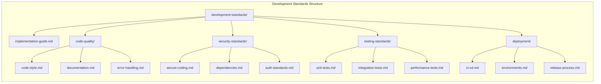

## 📝 Code Quality Standards

### 1. Code Style & Formatting

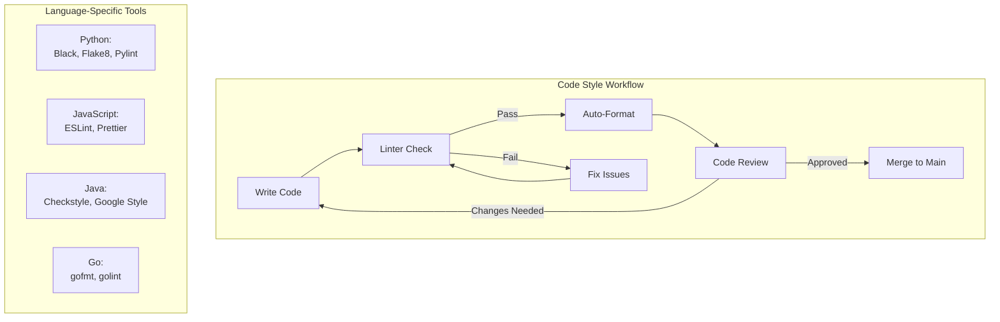

#### Implementation by Language

| Language | Formatter | Linter | Style Guide |
|----------|-----------|--------|-------------|
| **Python** | Black | Flake8, Pylint | PEP 8 |
| **JavaScript** | Prettier | ESLint | Airbnb, Google |
| **Java** | Google Java Format | Checkstyle | Google Java Style |
| **Go** | gofmt | golint, golangci-lint | Go Code Review |
| **TypeScript** | Prettier | ESLint + TypeScript | TypeScript Style Guide |

#### Configuration Example

```yaml
# .pre-commit-config.yaml
repos:
  - repo: https://github.com/psf/black
    rev: 23.3.0
    hooks:
      - id: black
        language_version: python3.11
  
  - repo: https://github.com/pycqa/flake8
    rev: 6.0.0
    hooks:
      - id: flake8
        args: [--max-line-length=100, --extend-ignore=E203]
  
  - repo: https://github.com/pre-commit/mirrors-eslint
    rev: v8.42.0
    hooks:
      - id: eslint
        files: \.(js|jsx|ts|tsx)$
```

### 2. Documentation Standards

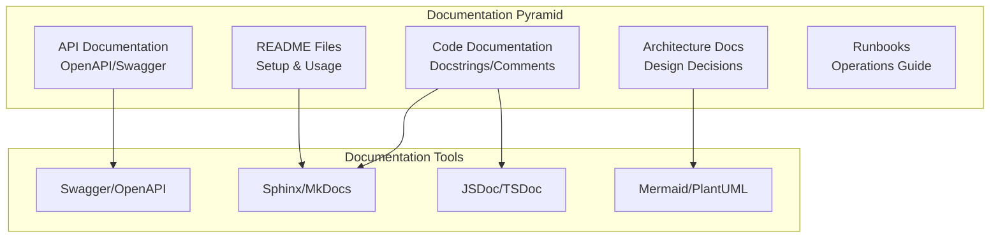

#### Documentation Requirements

1. **Code Comments**
   - Function/method docstrings with parameters and return types
   - Complex logic explanations
   - TODO/FIXME comments with issue tracking
   - Inline comments for non-obvious code

2. **API Documentation**
   - OpenAPI/Swagger specifications
   - Request/response examples
   - Authentication requirements
   - Error codes and handling

3. **Architecture Documentation**
   - System design diagrams
   - Decision records (ADRs)
   - Data flow diagrams
   - Component interactions

### 3. Error Handling Strategy

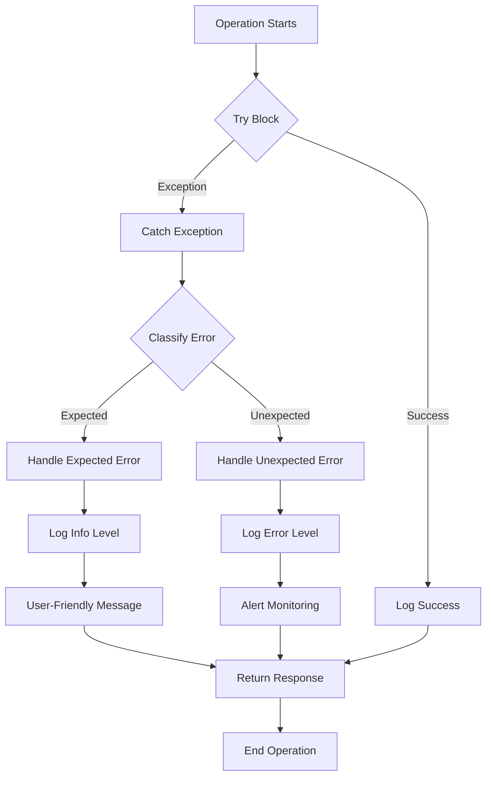

#### Error Handling Best Practices

```python
# Example: Structured Error Handling
from enum import Enum
from typing import Optional, Dict, Any
import logging
import traceback

class ErrorCategory(Enum):
    VALIDATION = "validation"
    AUTHENTICATION = "authentication"
    AUTHORIZATION = "authorization"
    NOT_FOUND = "not_found"
    CONFLICT = "conflict"
    SERVER_ERROR = "server_error"
    EXTERNAL_SERVICE = "external_service"

class ApplicationError(Exception):
    """Base application error with structured information"""
    def __init__(
        self,
        message: str,
        category: ErrorCategory,
        status_code: int = 500,
        details: Optional[Dict[str, Any]] = None,
        original_error: Optional[Exception] = None
    ):
        self.message = message
        self.category = category
        self.status_code = status_code
        self.details = details or {}
        self.original_error = original_error
        super().__init__(self.message)
    
    def to_dict(self) -> Dict[str, Any]:
        """Convert error to dictionary for API responses"""
        return {
            "error": {
                "message": self.message,
                "category": self.category.value,
                "status_code": self.status_code,
                "details": self.details,
                "timestamp": datetime.now().isoformat()
            }
        }

def handle_error(error: Exception, context: str = "") -> ApplicationError:
    """Centralized error handling"""
    logger = logging.getLogger(__name__)
    
    if isinstance(error, ApplicationError):
        logger.warning(f"{context}: {error.message}", extra=error.details)
        return error
    
    # Unexpected error - log full traceback
    logger.error(
        f"Unexpected error in {context}: {str(error)}",
        exc_info=True,
        extra={"traceback": traceback.format_exc()}
    )
    
    return ApplicationError(
        message="An unexpected error occurred",
        category=ErrorCategory.SERVER_ERROR,
        status_code=500,
        original_error=error
    )
```

## 🔐 Security Standards

### 1. Secure Coding Practices

```mermaid
graph TB
    subgraph "Security Layers"
        subgraph "Input Validation"
            VAL1[Sanitize Inputs]
            VAL2[Validate Schemas]
            VAL3[Type Checking]
        end
        
        subgraph "Authentication"
            AUTH1[Multi-Factor Auth]
            AUTH2[Secure Sessions]
            AUTH3[Token Management]
        end
        
        subgraph "Authorization"
            AUTHZ1[RBAC]
            AUTHZ2[Least Privilege]
            AUTHZ3[Access Control]
        end
        
        subgraph "Data Protection"
            DATA1[Encryption at Rest]
            DATA2[Encryption in Transit]
            DATA3[Data Masking]
        end
    end
    
    VAL1 --> SECURE[Secure Application]
    VAL2 --> SECURE
    VAL3 --> SECURE
    AUTH1 --> SECURE
    AUTH2 --> SECURE
    AUTH3 --> SECURE
    AUTHZ1 --> SECURE
    AUTHZ2 --> SECURE
    AUTHZ3 --> SECURE
    DATA1 --> SECURE
    DATA2 --> SECURE
    DATA3 --> SECURE
```

### 2. Dependency Management Workflow

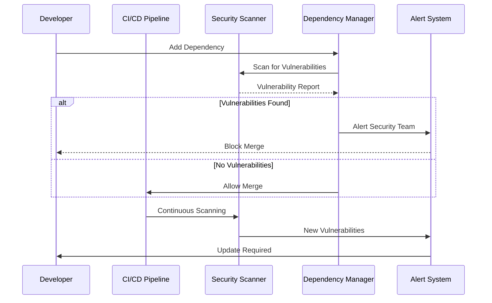

#### Dependency Security Checklist

- [ ] Pin dependency versions (no wildcards)
- [ ] Regular security scans (daily/weekly)
- [ ] Automated dependency updates
- [ ] License compliance review
- [ ] SBOM (Software Bill of Materials) generation
- [ ] Vulnerability remediation SLA (< 24h for critical)

## 🧪 Testing Standards

### 1. Testing Pyramid

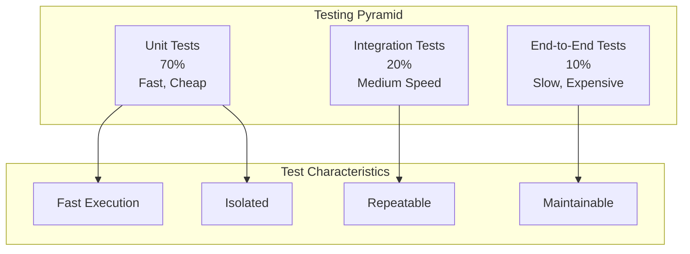

### 2. Test Coverage Strategy

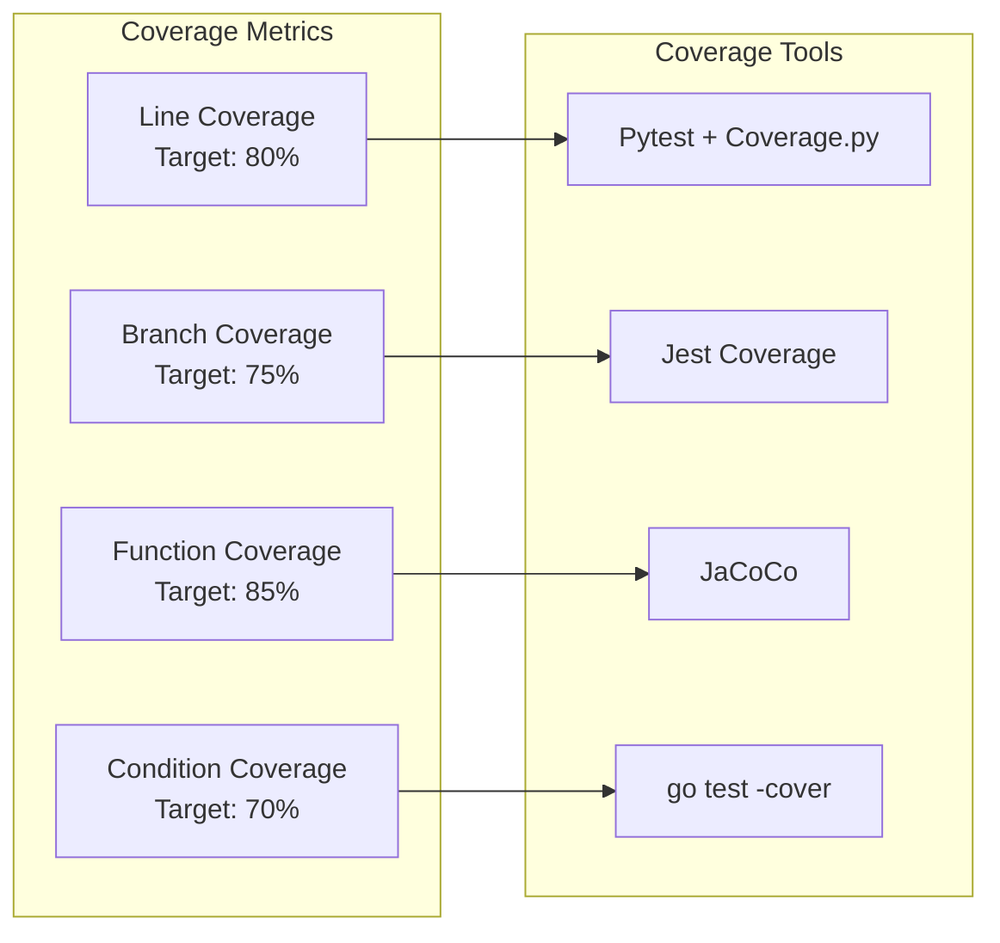

### 3. Testing Workflow

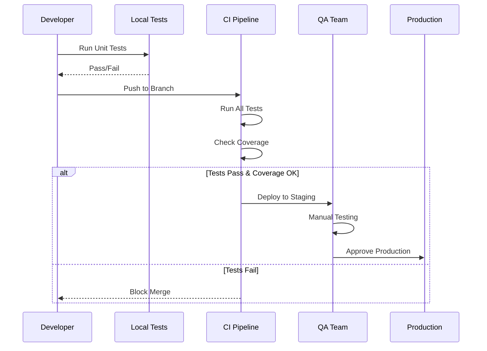

## 🚀 Deployment Standards

### 1. CI/CD Pipeline Architecture

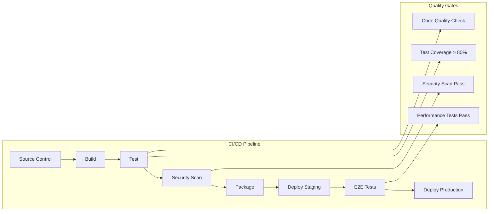

### 2. Environment Management

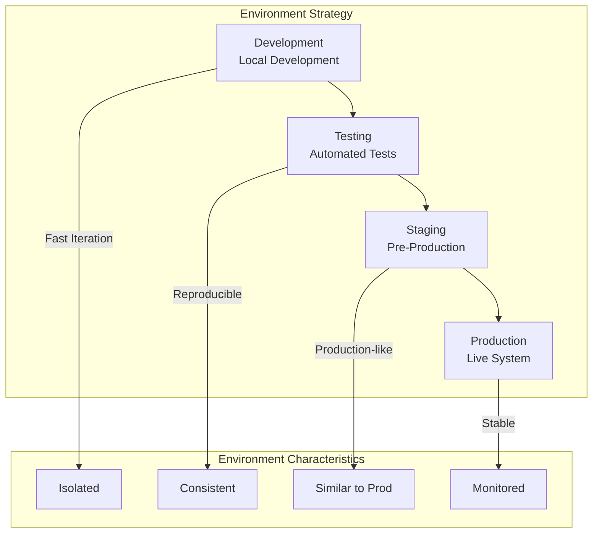

### 3. Release Management Process

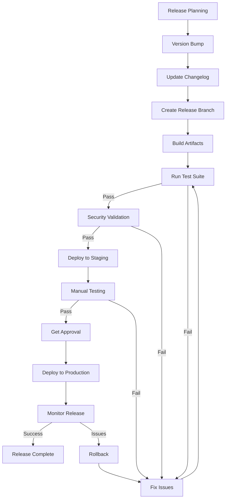

## 📊 Implementation Roadmap

### Phase 1: Foundation (Week 1-2)

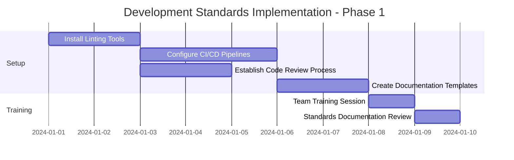

**Deliverables:**
- [ ] Linting and formatting tools configured
- [ ] CI/CD pipelines with quality gates
- [ ] Code review guidelines documented
- [ ] Documentation templates created
- [ ] Team training completed

### Phase 2: Standards Implementation (Week 3-4)

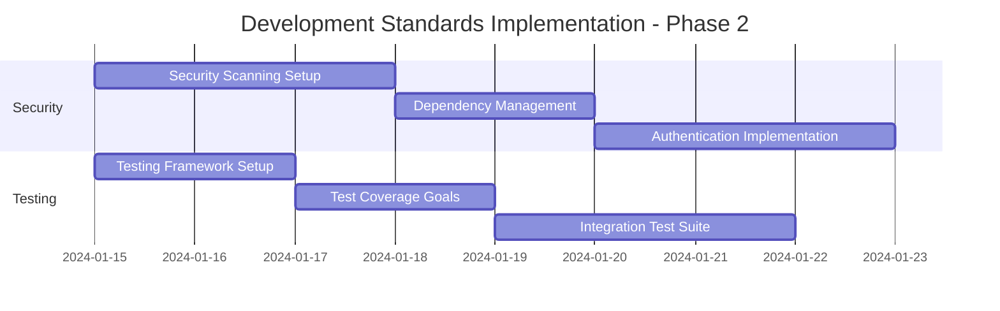

**Deliverables:**
- [ ] Security scanning automated
- [ ] Testing frameworks configured
- [ ] 80%+ test coverage achieved
- [ ] Monitoring and alerting setup

### Phase 3: Optimization (Week 5-6)

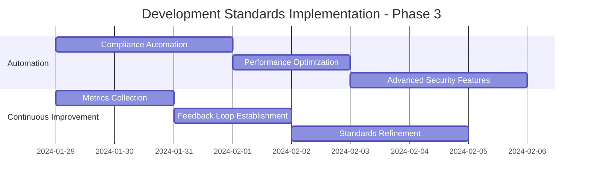

**Deliverables:**
- [ ] Automated compliance checking
- [ ] Performance benchmarks established
- [ ] Advanced security features implemented
- [ ] Continuous improvement process

## 📈 Success Metrics

### Code Quality Metrics

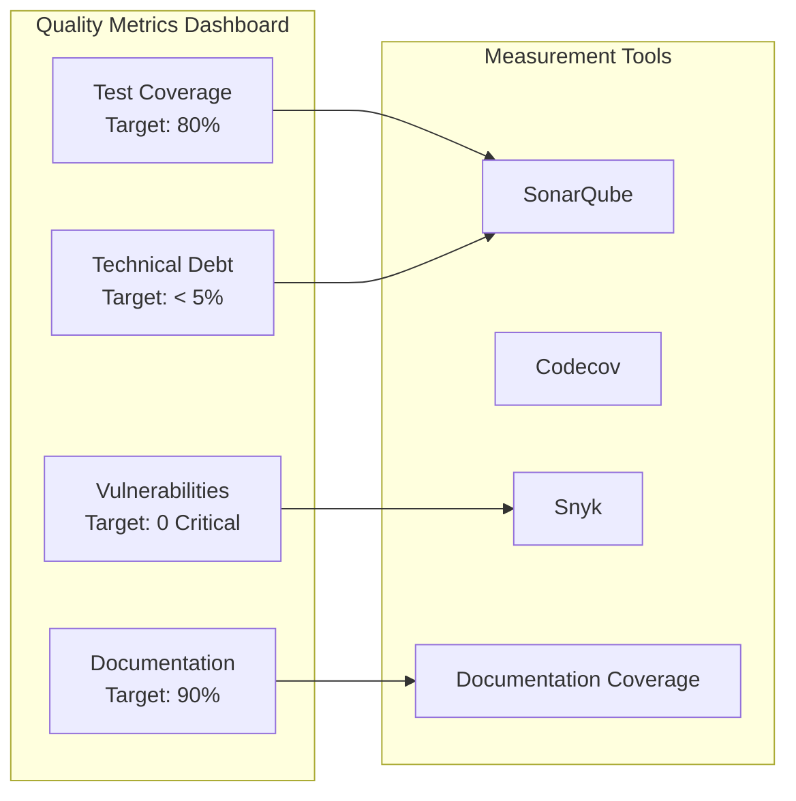

| Metric | Target | Measurement |
|--------|--------|-------------|
| **Test Coverage** | ≥ 80% | Code coverage tools |
| **Code Quality Score** | ≥ 8.0/10 | SonarQube |
| **Critical Vulnerabilities** | 0 | Security scanners |
| **Documentation Coverage** | ≥ 90% | Documentation tools |
| **Code Review Coverage** | 100% | Git statistics |
| **Build Success Rate** | ≥ 95% | CI/CD metrics |

### Performance Metrics

| Metric | Target | Measurement |
|--------|--------|-------------|
| **CI/CD Pipeline Duration** | < 10 min | Pipeline metrics |
| **Test Execution Time** | < 5 min | Test runner metrics |
| **Deployment Frequency** | Daily | Deployment logs |
| **Mean Time to Recovery** | < 30 min | Incident metrics |

### Compliance Metrics

| Metric | Target | Measurement |
|--------|--------|-------------|
| **Standards Adoption** | 100% | Compliance tools |
| **Security Compliance** | 100% | Security audits |
| **License Compliance** | 100% | License scanners |
| **Audit Trail Coverage** | 100% | Logging systems |

## 🛠️ Tools & Technologies

### Code Quality Tools

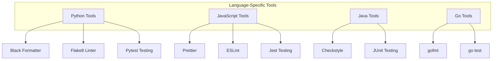

### Security Tools

- **Static Analysis**: SonarQube, CodeQL, Semgrep
- **Dependency Scanning**: Snyk, Dependabot, Trivy
- **Secret Scanning**: GitGuardian, TruffleHog
- **Container Scanning**: Trivy, Clair, Twistlock

### CI/CD Tools

- **GitHub Actions**: Workflow automation
- **GitLab CI**: Integrated CI/CD
- **Jenkins**: Self-hosted automation
- **CircleCI**: Cloud-based CI/CD

## 📚 Next Steps

1. **Review Standards**: Familiarize yourself with all standards
2. **Setup Tools**: Install and configure required tools
3. **Create Templates**: Set up project templates
4. **Team Training**: Conduct training sessions
5. **Pilot Project**: Start with a pilot project
6. **Iterate**: Continuously improve based on feedback

---

**Related Documentation:**
- [Code Quality Standards](./code-quality/)
- [Security Standards](../security-standards/)
- [Testing Standards](../testing-standards/)
- [Deployment Guide](./deployment/)
