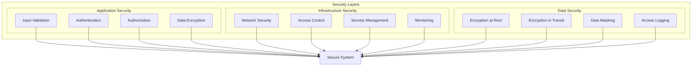
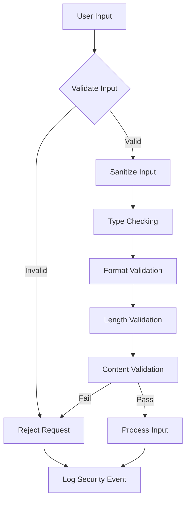
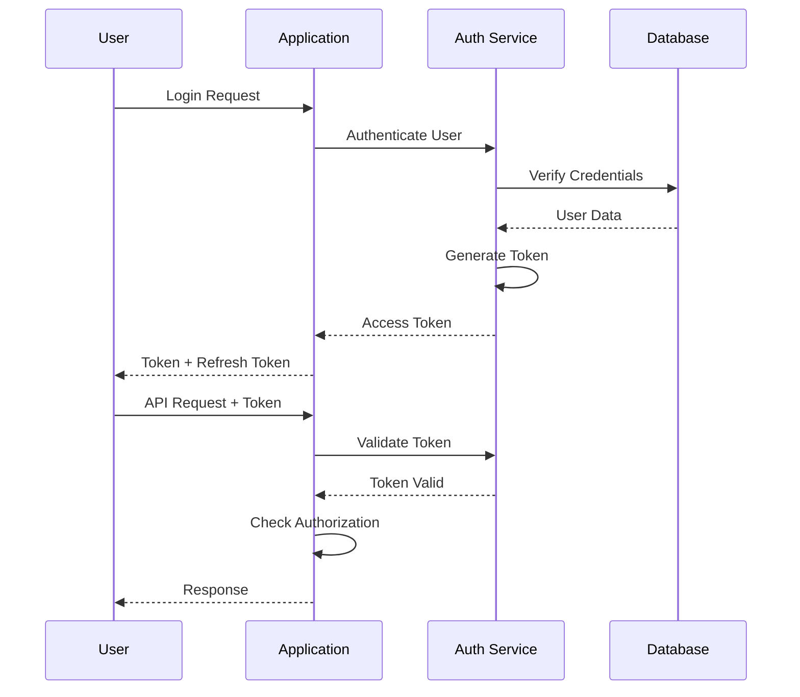
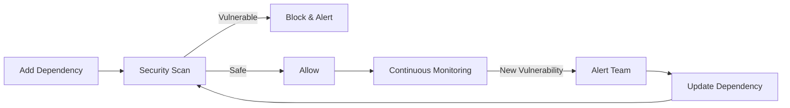
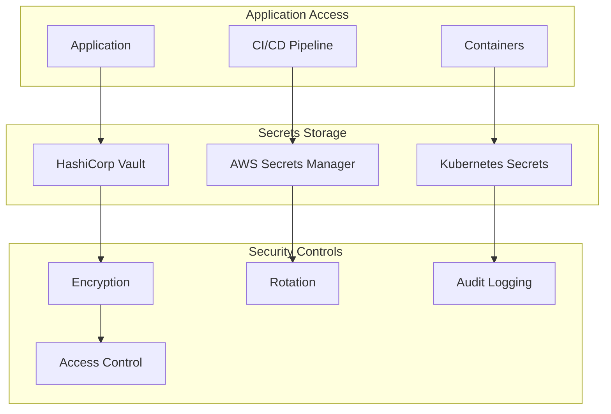
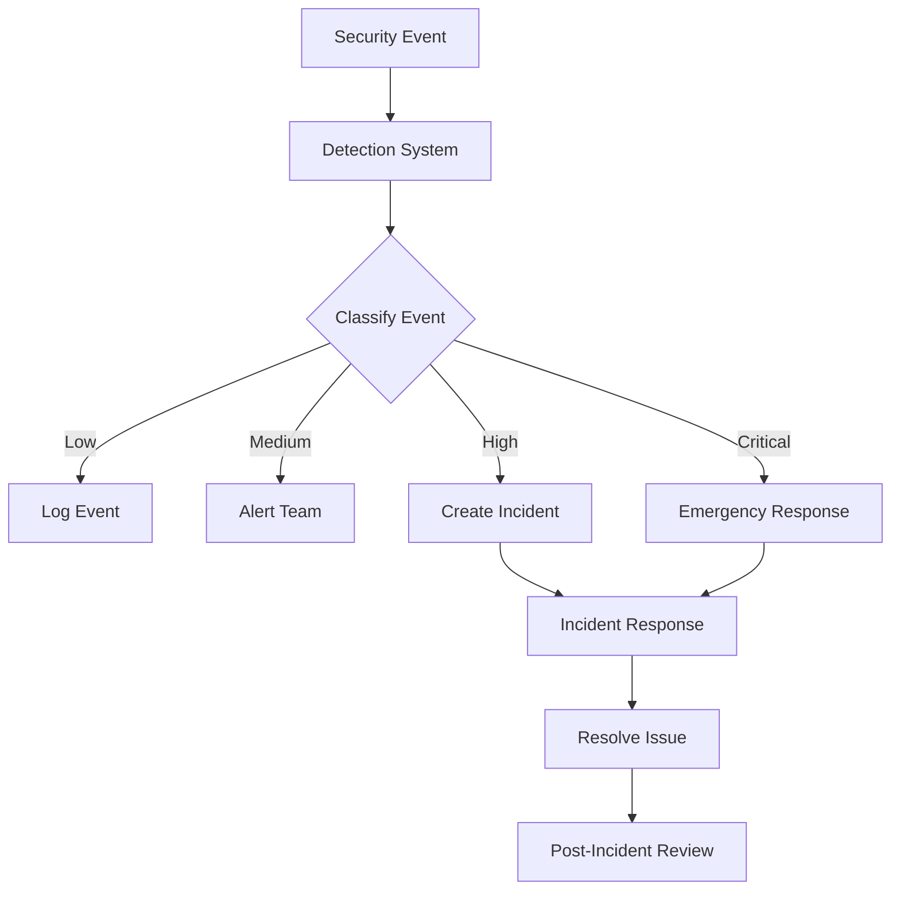
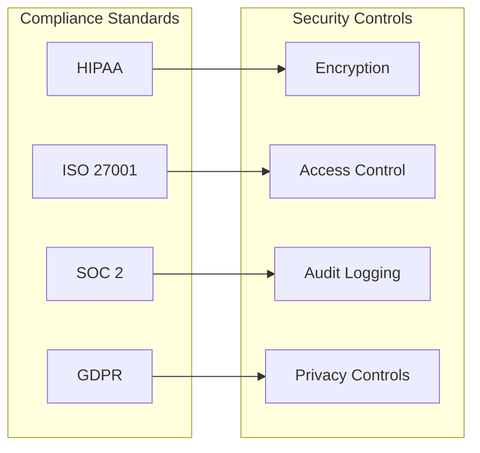

# 🔐 Security Standards

## 📋 Overview

Comprehensive security standards to protect applications, data, and infrastructure from threats and vulnerabilities.

## 🏗️ Security Architecture

## 🔒 Secure Coding Practices

### Input Validation Flow

### Authentication & Authorization

## 🛡️ Dependency Management

### Dependency Security Workflow

### Dependency Security Checklist

- [ ] Pin dependency versions (no wildcards)
- [ ] Regular security scans (daily/weekly)
- [ ] Automated dependency updates
- [ ] License compliance review
- [ ] SBOM (Software Bill of Materials) generation
- [ ] Vulnerability remediation SLA (< 24h for critical)

## 🔐 Secrets Management

### Secrets Management Architecture

## 🚨 Security Monitoring

### Security Event Flow

## 📊 Security Compliance

### Compliance Framework

---

**Next**: [Testing Standards](../testing-standards/)

