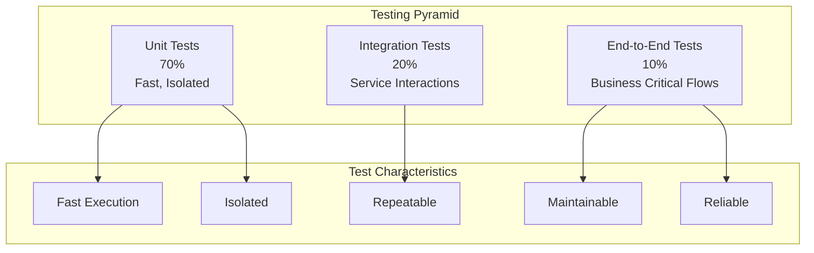
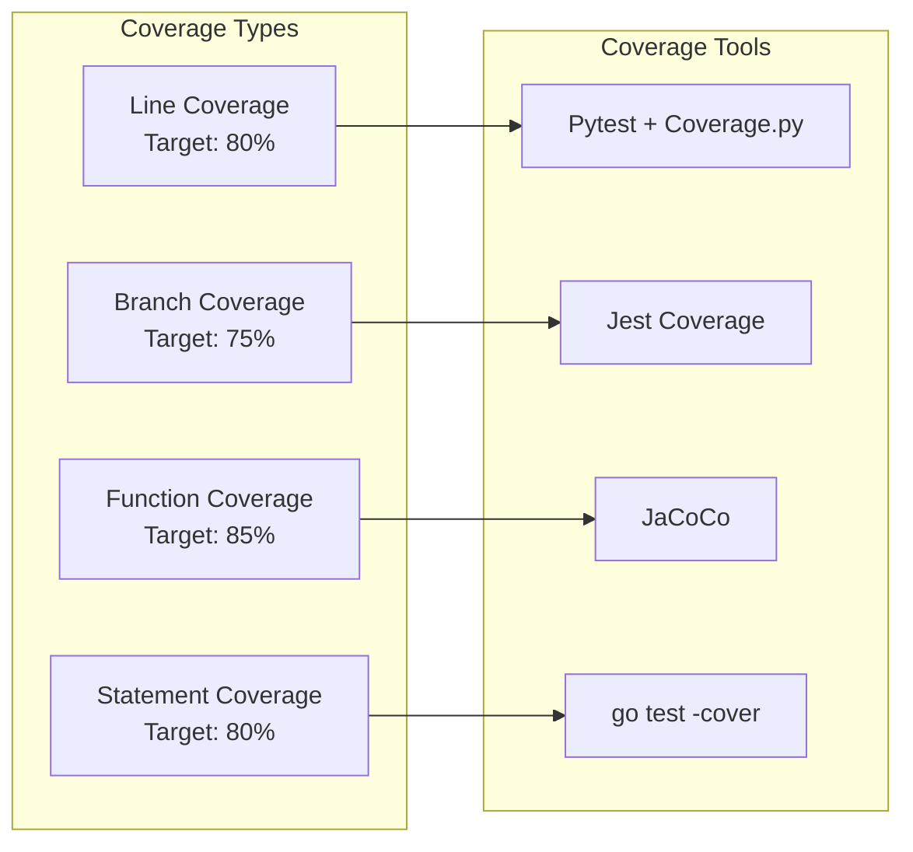
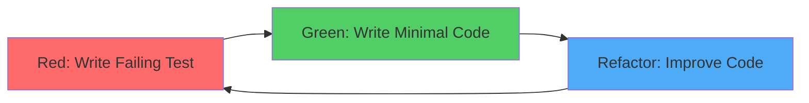
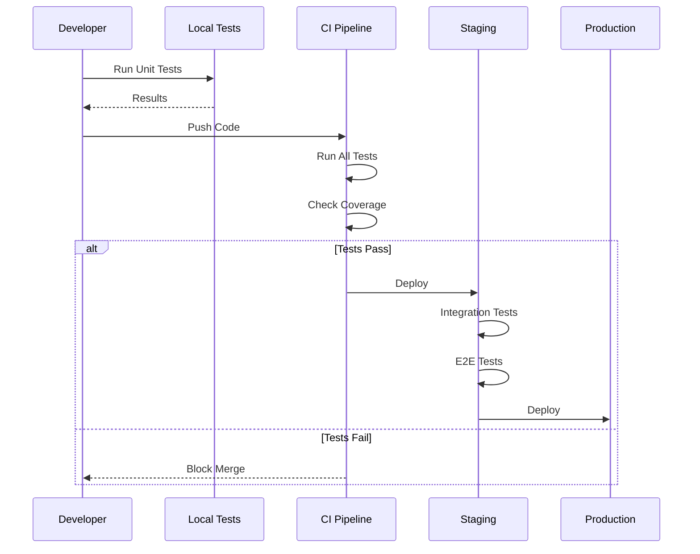
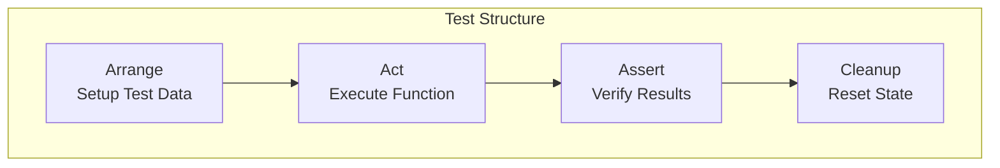
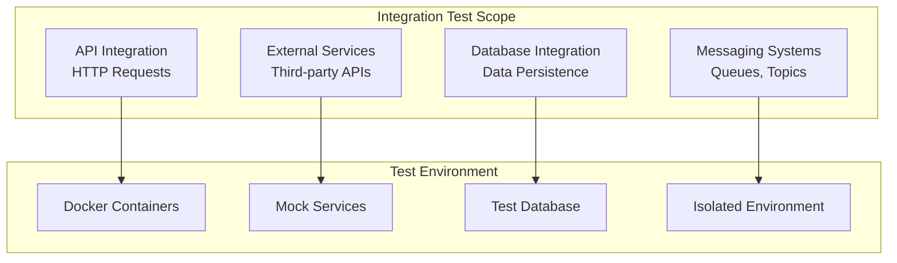
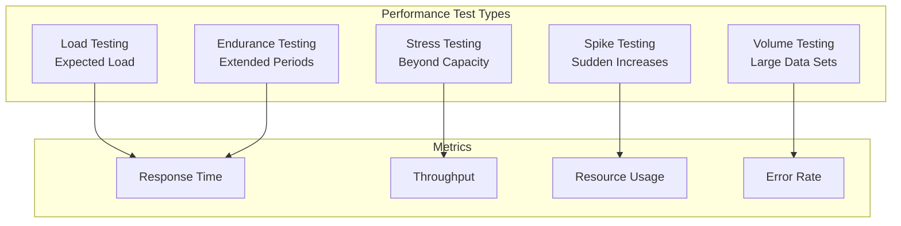
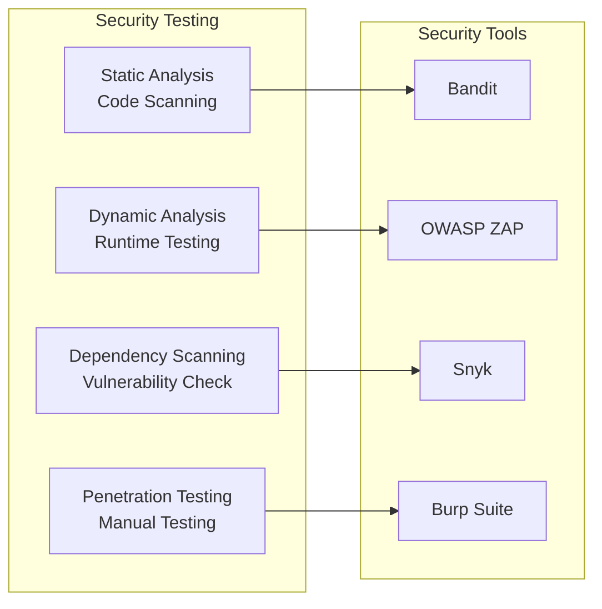
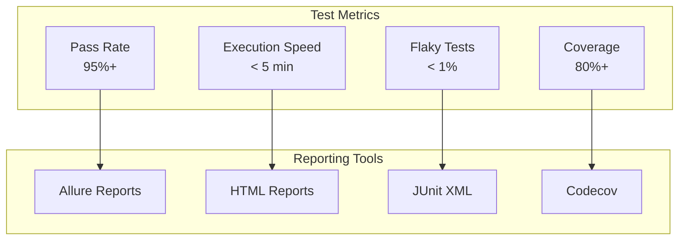

# 🧪 Testing Standards

## 📋 Overview

Comprehensive testing standards to ensure software quality, reliability, and maintainability through systematic testing practices.

## 🏗️ Testing Strategy Architecture



## 📊 Test Coverage Strategy

### Coverage Metrics



### Coverage Requirements by Component

| Component Type | Minimum Coverage | Target Coverage |
|----------------|------------------|-----------------|
| **Core Business Logic** | 90% | 95% |
| **API Endpoints** | 80% | 90% |
| **Utility Functions** | 75% | 85% |
| **Configuration** | 60% | 70% |
| **Overall Project** | 70% | 80% |

## 🔄 Testing Workflow

### Test-Driven Development (TDD) Cycle



### Testing Pipeline



## 📝 Unit Testing Standards

### Unit Test Structure



### Unit Test Example

```python
import pytest
from unittest.mock import Mock, patch
from data_processor import DataProcessor

class TestDataProcessor:
    """Test suite for DataProcessor class."""
    
    @pytest.fixture
    def processor(self):
        """Create DataProcessor instance for testing."""
        return DataProcessor()
    
    @pytest.fixture
    def sample_data(self):
        """Create sample test data."""
        return pd.DataFrame({
            'feature1': [1, 2, 3],
            'feature2': [4, 5, 6],
            'target': [0, 1, 0]
        })
    
    def test_transform_valid_data(self, processor, sample_data):
        """Test transformation with valid data."""
        # Arrange
        expected_columns = ['feature1', 'feature2', 'target']
        
        # Act
        result = processor.transform(sample_data)
        
        # Assert
        assert isinstance(result, pd.DataFrame)
        assert list(result.columns) == expected_columns
        assert len(result) == len(sample_data)
    
    def test_transform_invalid_input(self, processor):
        """Test transformation with invalid input."""
        # Arrange
        invalid_input = "not a dataframe"
        
        # Act & Assert
        with pytest.raises(TypeError, match="Input must be a pandas DataFrame"):
            processor.transform(invalid_input)
    
    @patch('data_processor.logger')
    def test_transform_logs_success(self, mock_logger, processor, sample_data):
        """Test that successful transformation is logged."""
        # Act
        processor.transform(sample_data)
        
        # Assert
        mock_logger.info.assert_called_once()
```

## 🔗 Integration Testing Standards

### Integration Test Architecture



### Integration Test Example

```python
import pytest
import requests
from fastapi.testclient import TestClient
from app.main import app

class TestAPIIntegration:
    """Integration tests for API endpoints."""
    
    @pytest.fixture
    def client(self):
        """Create test client."""
        return TestClient(app)
    
    @pytest.fixture
    def test_user(self):
        """Create test user."""
        return {
            "username": "testuser",
            "email": "test@example.com",
            "password": "securepassword123"
        }
    
    def test_create_user_integration(self, client, test_user):
        """Test user creation end-to-end."""
        # Act
        response = client.post("/api/v1/users", json=test_user)
        
        # Assert
        assert response.status_code == 201
        data = response.json()
        assert data["username"] == test_user["username"]
        assert "id" in data
    
    def test_user_authentication_flow(self, client, test_user):
        """Test complete authentication flow."""
        # Create user
        create_response = client.post("/api/v1/users", json=test_user)
        assert create_response.status_code == 201
        
        # Login
        login_response = client.post(
            "/api/v1/auth/login",
            json={
                "username": test_user["username"],
                "password": test_user["password"]
            }
        )
        assert login_response.status_code == 200
        assert "access_token" in login_response.json()
```

## 🚀 Performance Testing Standards

### Performance Test Types



### Performance Test Example

```python
import pytest
import time
from locust import HttpUser, task, between

class APIUser(HttpUser):
    """Locust user class for API performance testing."""
    wait_time = between(1, 3)
    
    @task(3)
    def get_users(self):
        """Test GET /api/v1/users endpoint."""
        self.client.get("/api/v1/users")
    
    @task(1)
    def create_user(self):
        """Test POST /api/v1/users endpoint."""
        self.client.post(
            "/api/v1/users",
            json={
                "username": f"user_{int(time.time())}",
                "email": f"user_{int(time.time())}@example.com"
            }
        )

# Performance test configuration
PERFORMANCE_TARGETS = {
    "p95_response_time": 200,  # milliseconds
    "p99_response_time": 500,  # milliseconds
    "error_rate": 0.01,  # 1%
    "throughput": 1000  # requests per second
}
```

## 🔒 Security Testing Standards

### Security Test Categories



### Security Test Example

```python
import pytest
from security import SecurityTester

class TestSecurity:
    """Security testing suite."""
    
    def test_sql_injection_protection(self, client):
        """Test protection against SQL injection."""
        malicious_input = "'; DROP TABLE users; --"
        
        response = client.get(
            f"/api/v1/users?search={malicious_input}"
        )
        
        # Should not cause error or data loss
        assert response.status_code in [200, 400]
        assert "DROP" not in response.text
    
    def test_xss_protection(self, client):
        """Test protection against XSS attacks."""
        xss_payload = "<script>alert('XSS')</script>"
        
        response = client.post(
            "/api/v1/users",
            json={"username": xss_payload}
        )
        
        # Should sanitize input
        assert "<script>" not in response.text
    
    def test_authentication_required(self, client):
        """Test that protected endpoints require authentication."""
        response = client.get("/api/v1/protected")
        
        assert response.status_code == 401
        assert "authentication" in response.text.lower()
```

## 📊 Test Metrics and Reporting

### Test Metrics Dashboard



## 🎯 Testing Best Practices

1. **Write Tests First**: TDD approach when possible
2. **Test One Thing**: Each test should verify one behavior
3. **Use Descriptive Names**: Test names should describe what they test
4. **Keep Tests Fast**: Unit tests should run in milliseconds
5. **Isolate Tests**: Tests should not depend on each other
6. **Use Mocks Wisely**: Mock external dependencies, not internal logic
7. **Test Edge Cases**: Include boundary conditions and error cases
8. **Maintain Test Data**: Use fixtures and factories for test data
9. **Review Test Code**: Test code should be as clean as production code
10. **Monitor Test Health**: Track flaky tests and fix them

---

**Next**: [Deployment Standards](../deployment/)

