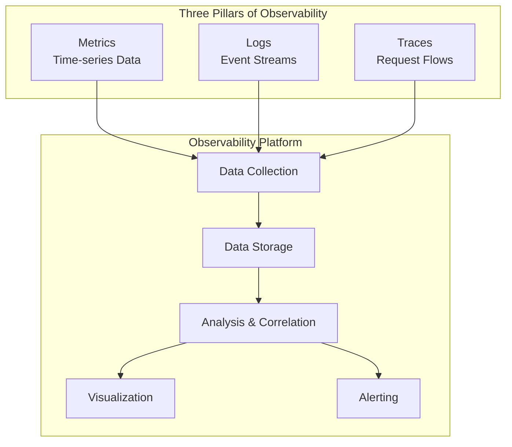
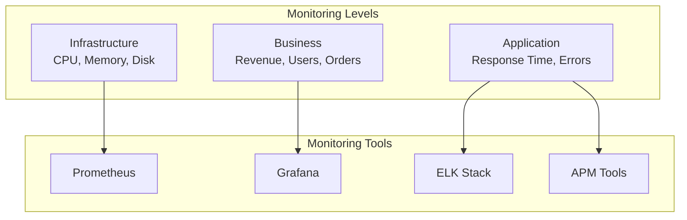
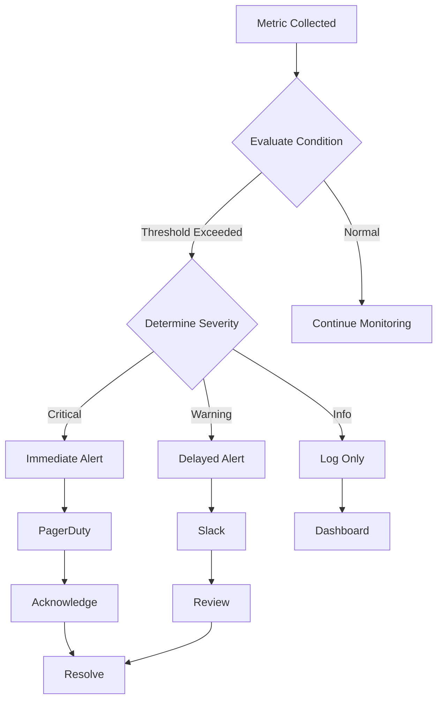
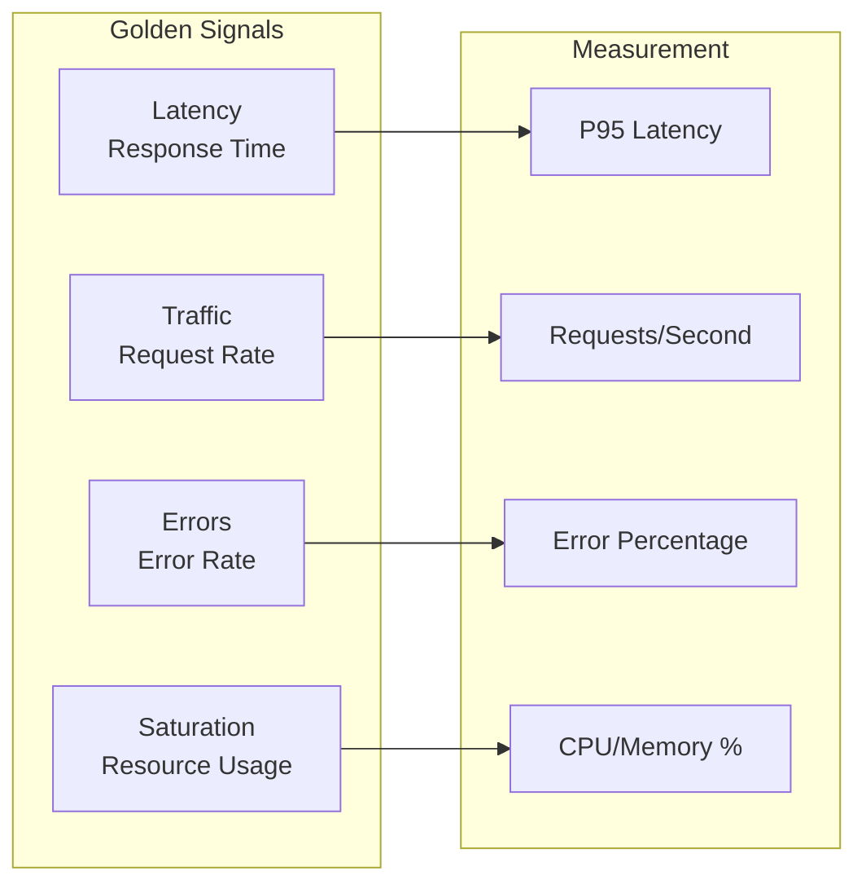

# 📊 Monitoring Standards

## 📋 Overview

Comprehensive monitoring and observability standards for ensuring system reliability, performance, and availability.

## 🏗️ Observability Architecture

## 📈 Monitoring Strategy

### Monitoring Hierarchy

## 🚨 Alerting Strategy

### Alerting Pipeline

## 📊 Key Metrics

### Golden Signals

## 🎯 Monitoring Best Practices

1. **Monitor Everything**: Infrastructure, application, business metrics
2. **Set Appropriate Thresholds**: Avoid alert fatigue
3. **Use Dashboards**: Visual representation of metrics
4. **Implement Logging**: Structured, searchable logs
5. **Distributed Tracing**: Track requests across services
6. **Alert on Symptoms**: Alert on user impact, not just metrics
7. **Document Runbooks**: Clear incident response procedures
8. **Regular Reviews**: Review and tune alerts regularly
9. **Test Alerts**: Ensure alerting works correctly
10. **Monitor Monitoring**: Ensure monitoring systems are healthy

---

**Next**: [Compliance Standards](../compliance-standards/)

