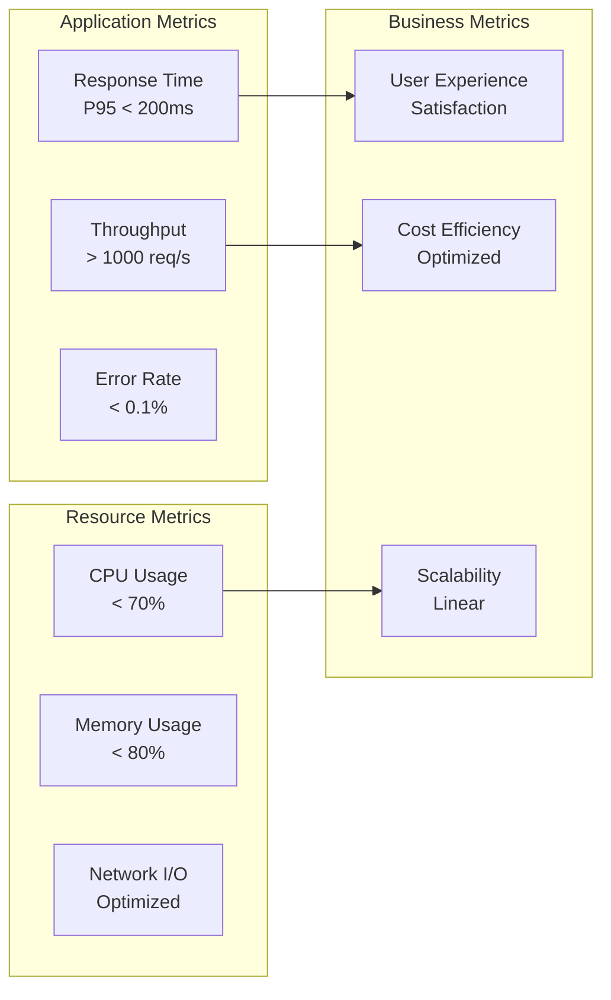
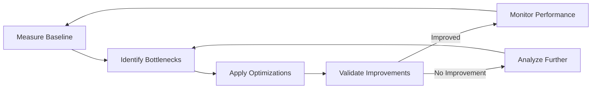
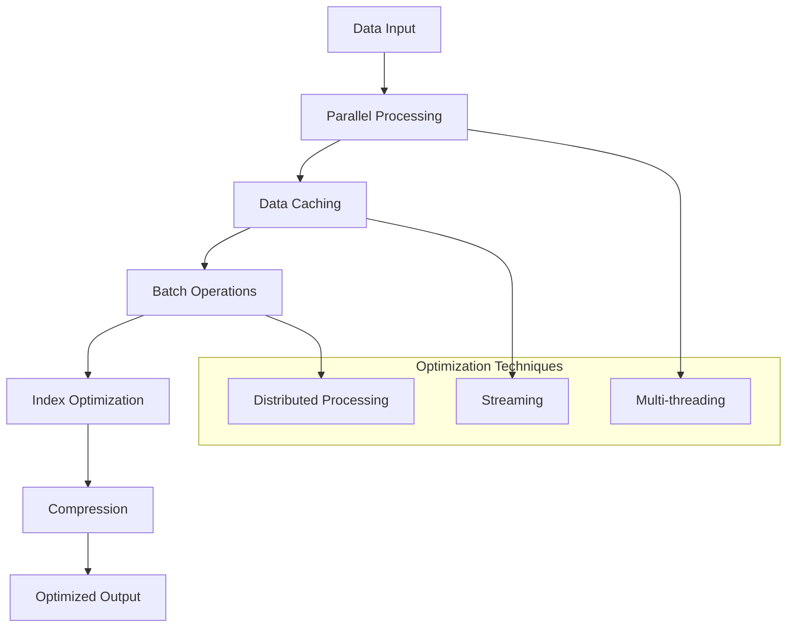
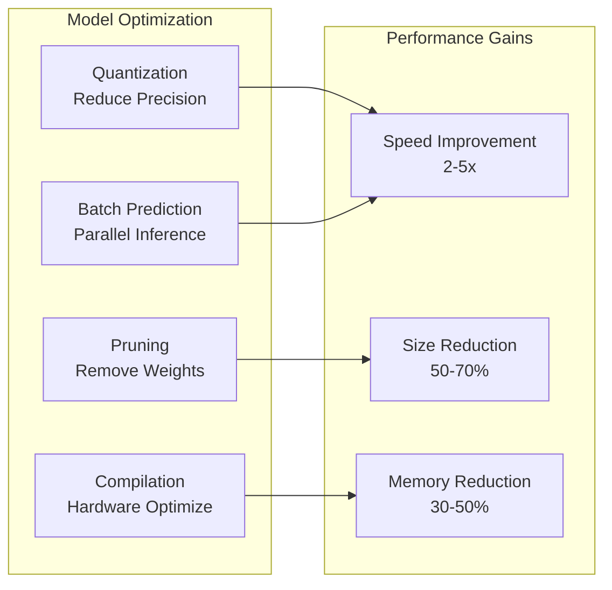
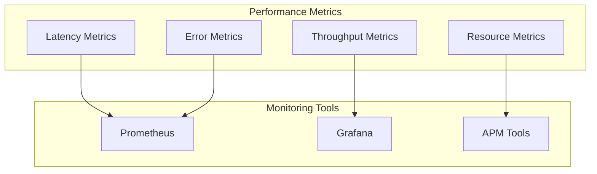

# ⚡ Performance Optimization

## 📋 Overview

Comprehensive performance optimization strategies for applications, data pipelines, and machine learning models.

## 🏗️ Performance Optimization Framework

```mermaid
graph TB
    subgraph "Optimization Dimensions"
        subgraph "Application Performance"
            APP1[Code Optimization]
            APP2[Algorithm Efficiency]
            APP3[Resource Management]
        end
        
        subgraph "Data Pipeline Performance"
            DATA1[Data Caching]
            DATA2[Parallel Processing]
            DATA3[Batch Operations]
        end
        
        subgraph "Model Performance"
            MODEL1[Model Quantization]
            MODEL2[Feature Selection]
            MODEL3[Inference Optimization]
        end
        
        subgraph "Infrastructure Performance"
            INFRA1[Resource Scaling]
            INFRA2[Load Balancing]
            INFRA3[CDN Distribution]
        end
    end
    
    APP1 --> PERFORMANCE[Optimized System]
    APP2 --> PERFORMANCE
    APP3 --> PERFORMANCE
    DATA1 --> PERFORMANCE
    DATA2 --> PERFORMANCE
    DATA3 --> PERFORMANCE
    MODEL1 --> PERFORMANCE
    MODEL2 --> PERFORMANCE
    MODEL3 --> PERFORMANCE
    INFRA1 --> PERFORMANCE
    INFRA2 --> PERFORMANCE
    INFRA3 --> PERFORMANCE
```



## 📊 Performance Metrics

### Key Performance Indicators



## 🔄 Optimization Process

### Performance Optimization Cycle



## 🚀 Application Optimization

### Code Optimization Strategies

```mermaid
graph TB
    subgraph "Optimization Techniques"
        ALGO[Algorithm Selection<br/>O(n log n) vs O(n²)]
        CACHE[Caching<br/>In-Memory, Redis]
        ASYNC[Async Processing<br/>Non-blocking I/O]
        POOL[Connection Pooling<br/>Reuse Connections]
    end
    
    subgraph "Profiling Tools"
        CPROFILE[cProfile]
        MEMORY[Memory Profiler]
        LINE[Line Profiler]
    end
    
    ALGO --> CPROFILE
    CACHE --> MEMORY
    ASYNC --> LINE
    POOL --> CPROFILE
```

## 📈 Data Pipeline Optimization

### Pipeline Optimization Strategies



## 🤖 Model Performance Optimization

### Model Optimization Pipeline



## 📊 Performance Monitoring

### Monitoring Dashboard



## 🎯 Optimization Best Practices

1. **Measure First**: Always measure before optimizing
2. **Profile Code**: Use profiling tools to find bottlenecks
3. **Optimize Hot Paths**: Focus on frequently executed code
4. **Cache Strategically**: Cache expensive computations
5. **Use Appropriate Data Structures**: Choose efficient data structures
6. **Parallelize When Possible**: Leverage multi-threading/processing
7. **Monitor Continuously**: Track performance metrics
8. **Test Performance**: Include performance tests in CI/CD
9. **Document Optimizations**: Record optimization decisions
10. **Review Regularly**: Regular performance reviews

---

**Next**: [Scalability Patterns](../scalability-patterns/)

