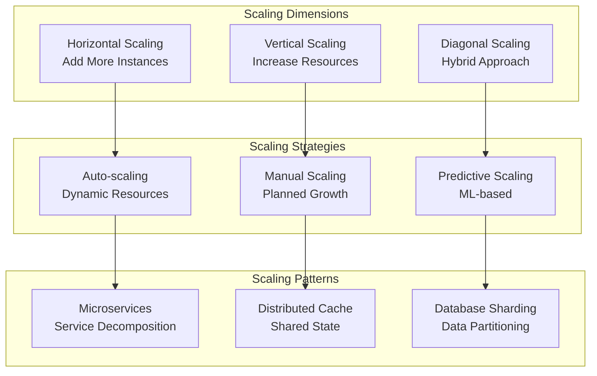
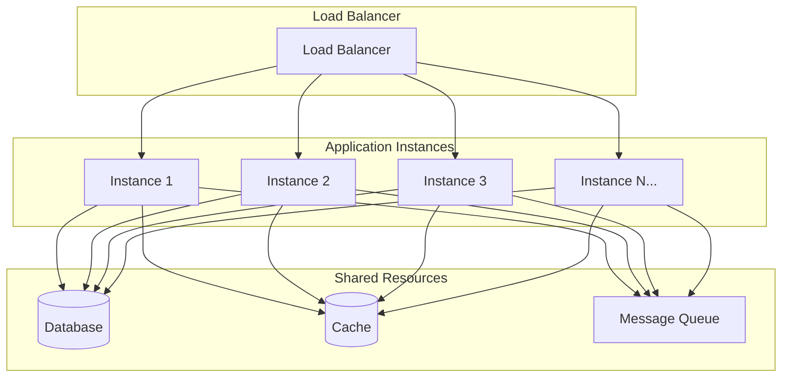
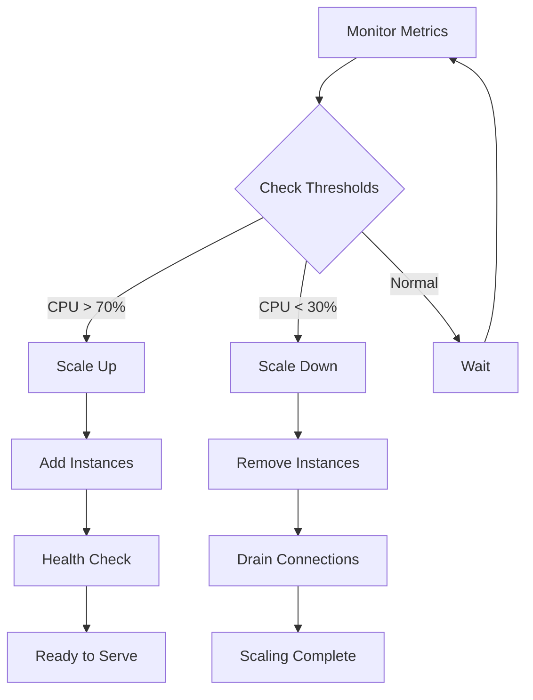
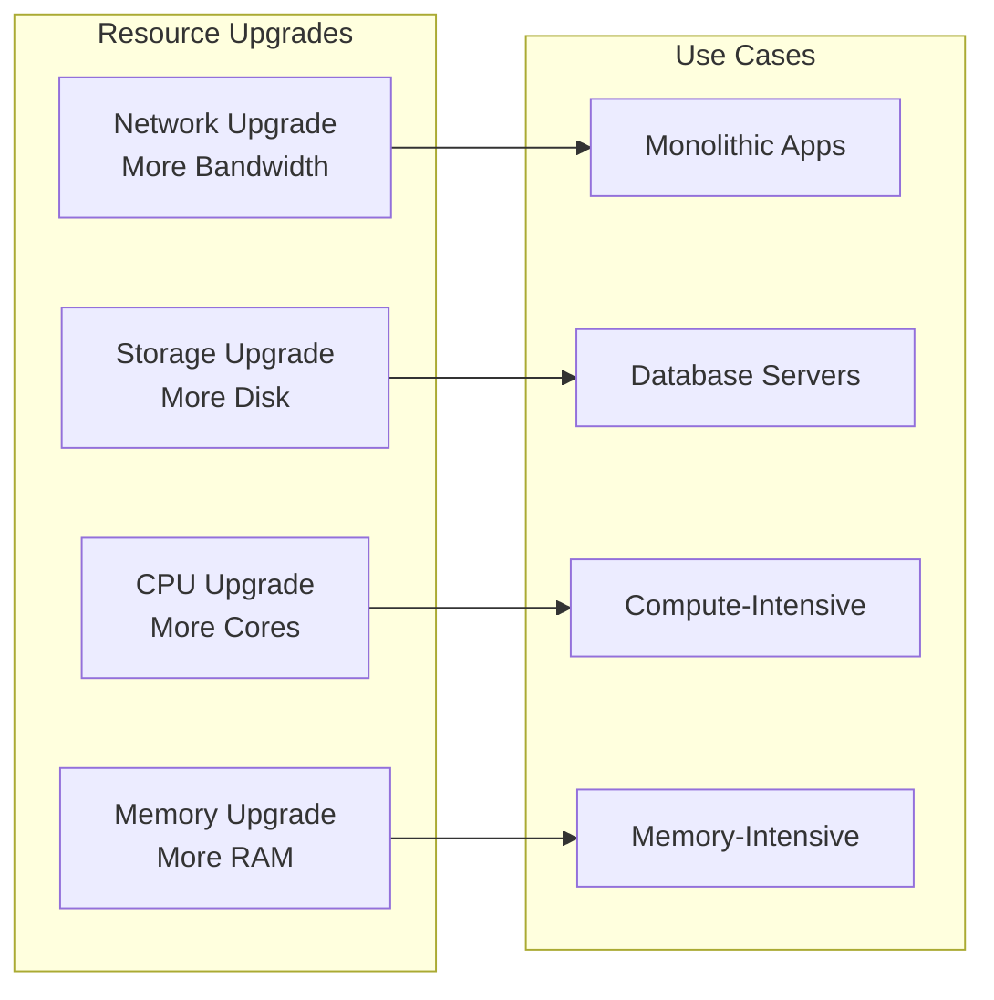
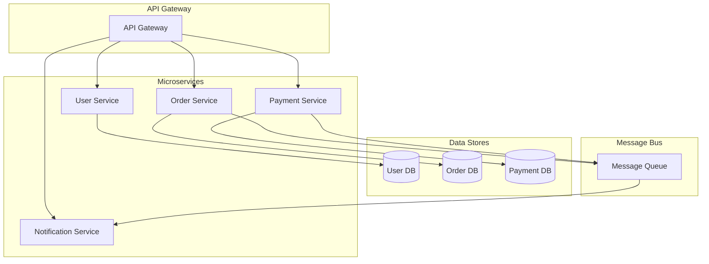
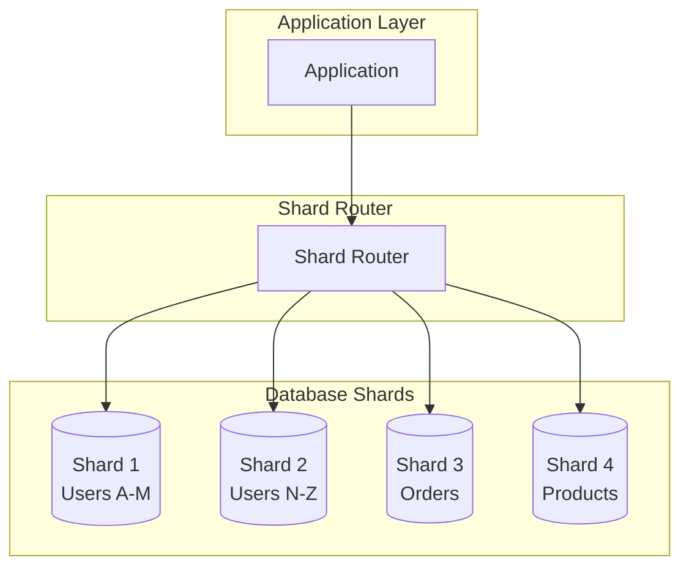
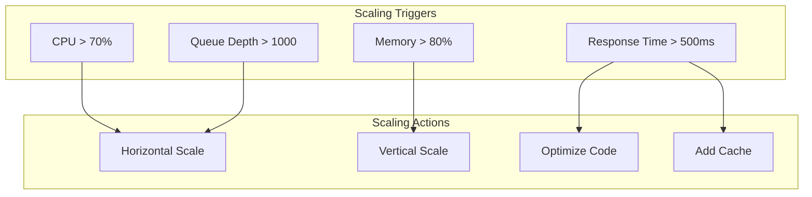

# 📈 Scalability Patterns

## 📋 Overview

Comprehensive scalability patterns and strategies for building systems that can grow with demand.

## 🏗️ Scalability Architecture

## 🔄 Horizontal Scaling

### Horizontal Scaling Architecture

### Auto-scaling Configuration

## ⬆️ Vertical Scaling

### Vertical Scaling Strategy

## 🏛️ Architectural Patterns

### Microservices Architecture

### Database Sharding

## 📊 Scaling Metrics

### Scaling Decision Matrix

## 🎯 Scalability Best Practices

1. **Design for Scale**: Plan scalability from the start
2. **Use Horizontal Scaling**: Prefer horizontal over vertical
3. **Implement Caching**: Reduce database load
4. **Use Load Balancers**: Distribute traffic evenly
5. **Database Optimization**: Index, partition, shard
6. **Async Processing**: Use queues for heavy operations
7. **CDN for Static Content**: Reduce server load
8. **Monitor Metrics**: Track scaling triggers
9. **Test Scaling**: Load test scaling behavior
10. **Document Patterns**: Document scaling strategies

---

**Next**: [Monitoring Standards](../monitoring-standards/)

